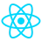

    

        <h2 style="color: rgb(177, 209, 138)">📱🌎 Android and Web Frontend Developer</h2>
        <h3 style="color: rgb(177, 209, 138)">My Stack</h3>
    

    

        
        
        
        
        
        
        
        
    

    <h2 style="color: rgb(177, 209, 138);">Contact with me</h2>
    📧 <a href="mailto:itzjuanmadev@proton.me" style="color: rgb(177, 209, 138); text-decoration: none;">itzjuanmadev@proton.me</a>
    🔗 <a href="https://www.linkedin.com/in/juan-manuel-velázquez-ba8a342ba" style="color: rgb(177, 209, 138); text-decoration: none;">LinkedIn</a>
    <h2 style="color: rgb(177, 209, 138)">Proyects 📘</h2>
    

        
        <h4 style="color: rgb(177, 209, 138)">CodeCollection</h4>
    

    
Repository where I publish code in different programming languages that could be useful for learn or solve a problem.

    Go to the repo -> <a href="https://github.com/juanmadev5/CodeCollection" style="color: rgb(177, 209, 138); text-decoration: none;">Here</a>
    <h4 style="color: rgb(177, 209, 138)">Web</h4>
    -> <a href="https://github.com/juanmadev5/me" style="color: rgb(177, 209, 138); text-decoration: none;">🧔 Me</a>
    -> <a href="https://github.com/juanmadev5/express-task-plus" style="color: rgb(177, 209, 138); text-decoration: none;">📓 Express Task+</a>
    -> <a href="https://github.com/juanmadev5/learn-with-me" style="color: rgb(177, 209, 138); text-decoration: none;">🗒️ LearnWithMe</a>
    <h4 style="color: rgb(177, 209, 138)">APIs</h4>
    -> <a href="https://github.com/juanmadev5/inventory-system-api" style="color: rgb(177, 209, 138); text-decoration: none;">🌠Simple Inventory System (ExpressJS)</a>
    -> <a href="https://github.com/juanmadev5/randominfo" style="color: rgb(177, 209, 138); text-decoration: none;">🌠Random Info (ASP.NET Core)</a>
    -> <a href="https://github.com/juanmadev5/PortfolioDataSource" style="color: rgb(177, 209, 138); text-decoration: none;">🌠Portfolio Data Source (Ktor)</a>
    <h4 style="color: rgb(177, 209, 138)">Android</h4>
    -> <a href="https://github.com/juanmadev5/Imagify" style="color: rgb(177, 209, 138); text-decoration: none;">🖼️ Imagify</a>
    -> <a href="https://github.com/juanmadev5/ToDoExpress" style="color: rgb(177, 209, 138); text-decoration: none;">📑 ToDoExpress</a>
    -> <a href="https://github.com/juanmadev5/TicTacToe" style="color: rgb(177, 209, 138); text-decoration: none;">🮠TicTacToe</a>
    -> <a href="https://github.com/juanmadev5/Flashlight" style="color: rgb(177, 209, 138); text-decoration: none;">🔦 Flashlight</a>
    <h4 style="color: rgb(177, 209, 138)">Flutter</h4>
    -> <a href="https://github.com/juanmadev5/onepieceapiexample" style="color: rgb(177, 209, 138); text-decoration: none;">📱 OnePieceAPIExample</a>
    -> <a href="https://github.com/juanmadev5/flutter-random-words" style="color: rgb(177, 209, 138); text-decoration: none;">📱 Random Words</a>
    -> <a href="https://github.com/juanmadev5/weather" style="color: rgb(177, 209, 138); text-decoration: none;">📱 Weather</a>

